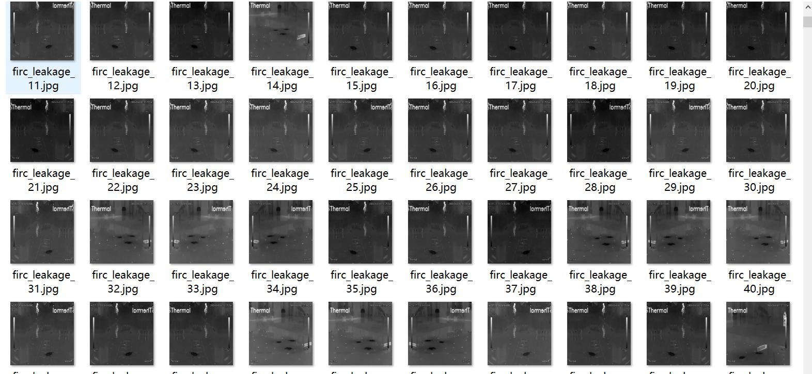
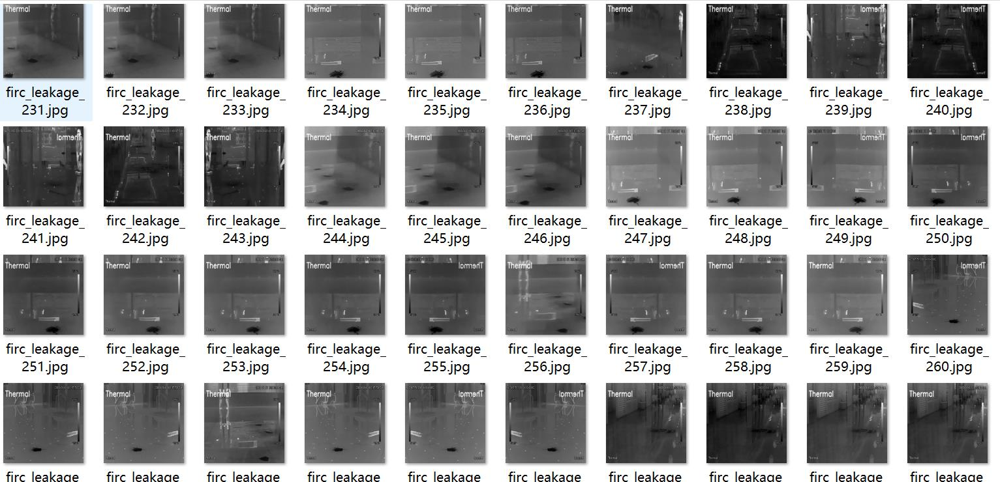
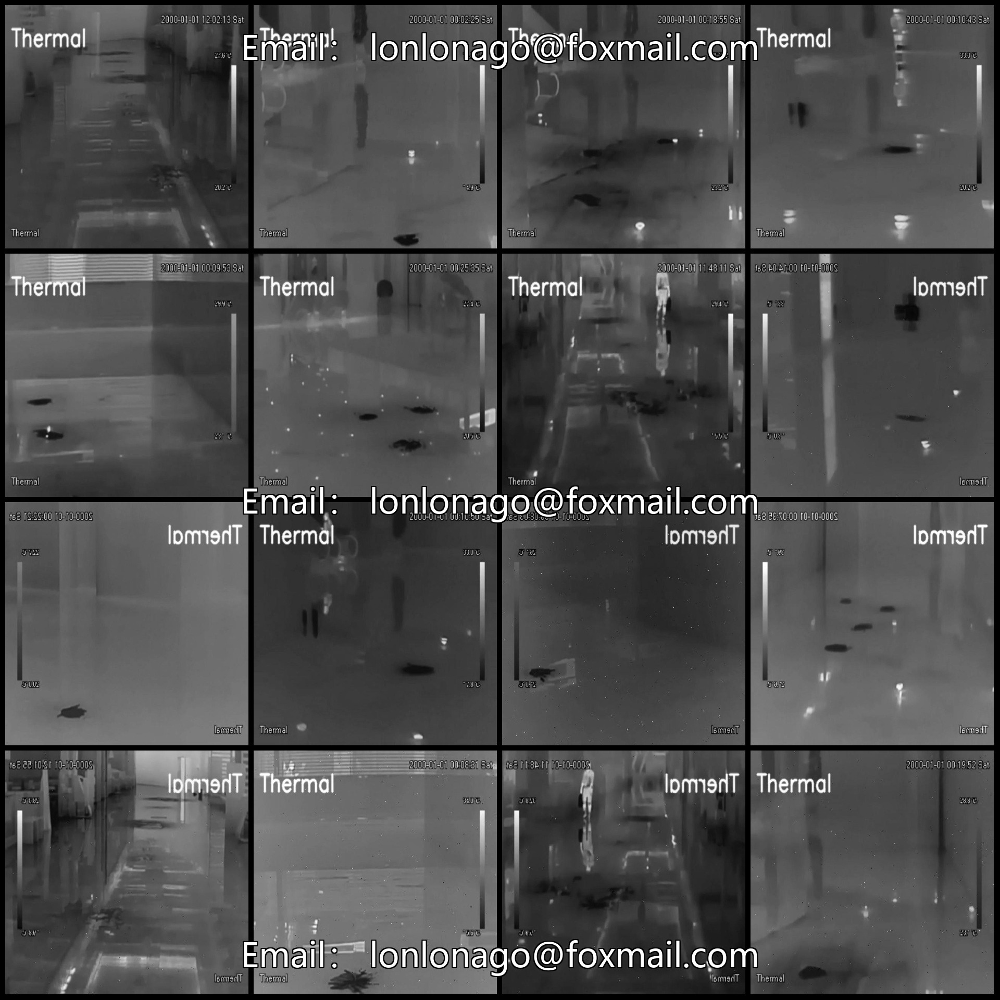
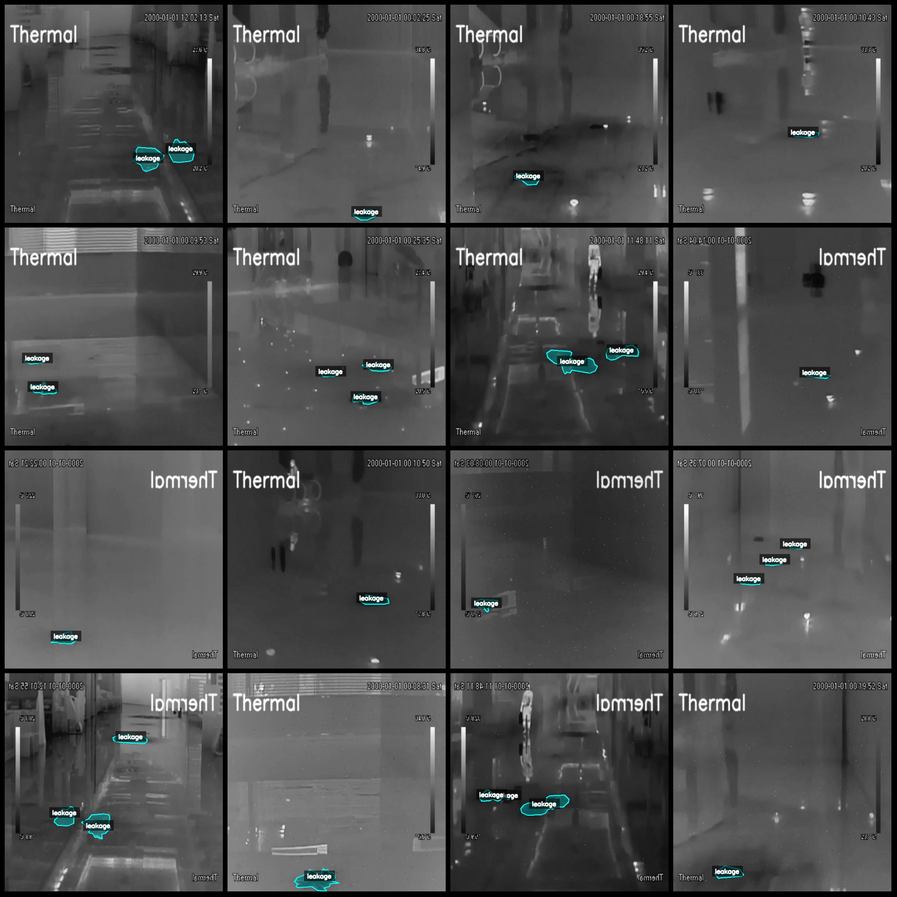
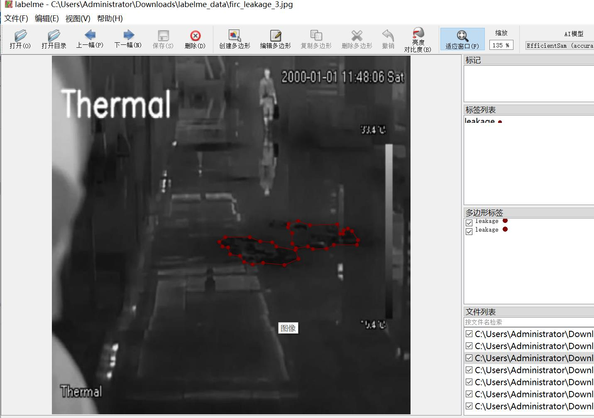

# Infrared Thermal Imaging Image Dataset for Gasoline Leaks and Factory Leaks Identification in the Gas Station

**Note:** The dataset contains many enhanced images, primarily adding salt and pepper noise as well as rotation enhancements.

**Dataset Format:** LabelMe format (excluding mask files, only containing jpg images and their corresponding json files)

**Number of Images (JPG Files):** 2612

**Number of Annotations (JSON Files):** 2612

**Number of Annotation Categories:** 1

**Annotation Category Name:** "leakage"

**Box Count per Category:** Leakage count = 3754

**Total Boxes:** 3754

**Annotation Tool:** LabelMe v5.5.0

**Image Resolution:** 640x640

**Application Area:** Gas station gas leak detection or factory liquid leak detection

**Annotation Rules:** Draw polygons around categories

**Important Notice:** You can use the LabelMe to edit the dataset, but the JSON dataset needs to be converted into either a Mask or Yolo format or COCO format for semantic segmentation or instance 
segmentation.

**Special Disclaimer:** This dataset does not guarantee the precision of trained models or weight files.

**Image Preview:**

**Annotation Example:**

- **Original Images (select 16 randomly):**

...

- **Annotation Drawing Results:**

...

- **LabelMe Edited Image Example:**

## Images

Here is a pay link on Stripe ( https://buy.stripe.com/3cs8yP7sY87d0vu9AB ). Please contact me lonlonago@foxmail.com after funding $89, and I will send you a complete data files , thank you!

